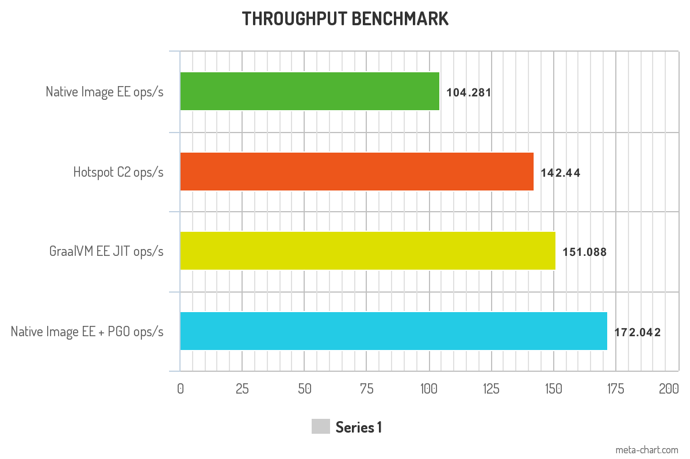

# Binary Tree Benchmark 

This sample code demonstrates how to run a JMH benchmark as a native image.


## Build and Run as a Java Application

To build and then run the benchmark as a Java application, run the following commands:

```shell
./mvnw clean package exec:exec
```

The program will run the benchmark and display, to the terminal, the results. We are interested in the final result and 

```shell
Benchmark          (binaryTreesN)   Mode  Cnt    Score    Error  Units
BinaryTrees.bench              14  thrpt    3  151.088 ± 15.815  ops/s
```

## Build and Run as a Native Image

Now to build a native executable, using Native Image. We are using Natiev IMage Enterprise edition, if you are using Community
Edition you will probably see lower figures for throughput.

```shell
./mvnw package -Pnative
./target/benchmark-binary-tree
```

```shell
Benchmark          (binaryTreesN)   Mode  Cnt    Score    Error  Units
BinaryTrees.bench              14  thrpt    3  104.281 ± 71.288  ops/s
```

## Optimise the Native Image - REQUIRES Enterprise Edition

If you are using Native Image Enterprise Edition you can improve the performance of this benchmark by taking 
advantage of a feature of Enterprise Edition, Profile Guided Optimisations (PGO).

**NOTE : This requires Enterpirse Edition**

First you will need to build an instrumented version of the native binary. This contains extra code to trace the execution of the program
and to profile it and therefor will run slower than the previous version. When the exeution has finished it will generate a profile file,
`default.iprof` in the root directory. This profile file, containing profiling information about the application, can be used to
build a more effiecient native executable.

```shell
./mvnw package -Pinstrumented
./target/benchmark-binary-tree-instr
```

Now you have generated the profile file, build and run the optimised version of the native executable.

```shell
./mvnw package -Poptimised
./target/benchmark-binary-tree-opt
```

```shell
Benchmark          (binaryTreesN)   Mode  Cnt    Score    Error  Units
BinaryTrees.bench              14  thrpt    3  172.042 ± 77.747  ops/s
```

## Your Mileage May Vary

The results you see will vary depending on the hardware you are running on. The results above are from a 2019 MacBook Pro, i7, 32 GB RAM
running  GraalVM EE 22.2.0 with JDK 17.

But collating the previous data into a chart:

